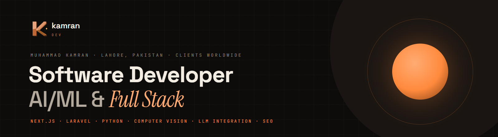
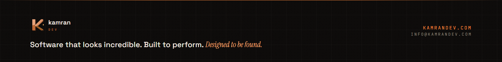

<a href="https://kamrandev.com"></a>

<div align="center">

<a href="https://kamrandev.com"></a>&nbsp;
<a href="https://kamrandev.com/work/"></a>&nbsp;
<a href="https://kamrandev.com/services/"></a>&nbsp;
<a href="https://www.linkedin.com/in/kamran-professional/"></a>&nbsp;
<a href="mailto:info@kamrandev.com"></a>

<br/><br/>

<code>Software that looks incredible. Built to perform. Designed to be found.</code>

</div>

<br/>

## About me


**Muhammad Kamran** is a software developer in Lahore, Pakistan, working across AI/ML and the full stack. I build modern web applications and AI-enabled products with **React, Next.js, TypeScript, Laravel/PHP, REST APIs and SQL**, and use **Python, OpenCV and PyTorch** for applied AI and computer-vision work — with performance, SEO and LLM integration engineered in from day one.

Currently **Full Stack Developer at Cross Media Sol**, shipping production Next.js and Laravel applications: ISR with on-demand revalidation, programmatic SEO across 130+ pages, and a mobile PageSpeed lifted from ~55 to ~90.

```ts
const kamran = {
  role:      "Software Developer — AI/ML & Full Stack",
  location:  "Lahore, Pakistan · clients worldwide · UTC+5",
  builds:    ["Web applications", "AI features & SaaS", "Websites"],
  stack:     ["Next.js", "React", "TypeScript", "Laravel", "Node.js", "Python"],
  ai:        ["LLM / API integration", "Computer vision (OpenCV, PyTorch)", "AEO / GEO"],
  baked_in:  ["Core Web Vitals", "Technical SEO", "Structured data"],
  site:      "https://kamrandev.com",
};
```

<br/>

## What I build


<table width="100%">
<tr>
<td width="33%" valign="top">

### 01 · Web applications
Custom web apps and AI-powered SaaS — dashboards, portals, subscriptions, API integrations. Next.js, React, TypeScript on the front; Laravel and Node.js behind it.

[→ Web application development](https://kamrandev.com/web-application-development/)

</td>
<td width="33%" valign="top">

### 02 · AI solutions
LLM and API integration, prompt engineering, AI pipelines, and computer-vision workflows in Python. Plus AEO/GEO so AI answer engines can understand and cite a site.

[→ AI solutions](https://kamrandev.com/ai-solutions/)

</td>
<td width="33%" valign="top">

### 03 · Websites & SEO
Fast, search-ready websites end to end — strategy, design, build, launch — with technical SEO, schema and Core Web Vitals built in, not bolted on.

[→ SEO & AI search](https://kamrandev.com/seo/)

</td>
</tr>
</table>

<br/>

## Selected work


| Project | What it is | Stack |
|:--|:--|:--|
| [**Resumaic**](https://kamrandev.com/work/resumaic/) | AI career platform — reusable Persona, AI resumes & cover letters, ATS checker, shareable profile cards, Stripe subscriptions, Google OAuth | Next.js · Laravel · Node.js · Stripe |
| [**OnlineToolPot**](https://kamrandev.com/work/onlinetoolpot/) | Multi-tool platform with programmatic SEO across 130+ tool pages; mobile PageSpeed ~55 → ~90 | Next.js · TypeScript · Redux · React Query |
| [**Real-Estate Image QC**](https://kamrandev.com/work/real-estate-image-qc/) | Computer-vision workflows for photo quality control — scene classification, image comparison, exposure / HDR / similarity signals | Python · OpenCV · PyTorch |
| [**Ertakcham**](https://kamrandev.com/work/ertakcham/) | Production content platform — SEO architecture and Core Web Vitals, delivered end to end | Next.js · TypeScript · Vercel |
| [**Huckleberry's**](https://kamrandev.com/work/huckleberrys-restaurant/) | UK restaurant website with local SEO — structured data and Google Business Profile alignment | WordPress · Schema.org |

→ All case studies: [kamrandev.com/work](https://kamrandev.com/work/)

<br/>

## Tech stack


#### Development

<p>
<a href="https://skillicons.dev"></a>
</p>
<p>


</p>

#### AI / ML

<p>
<a href="https://skillicons.dev"></a>
</p>
<p>


</p>

#### SEO & analytics

<p>


</p>

#### Infrastructure & tools

<p>
<a href="https://skillicons.dev"></a>
</p>
<p>


</p>

<br/>

## GitHub activity


<div align="center">


</div>

<br/>

## Let's build something


<p>
  <a href="https://kamrandev.com/contact/"></a>&nbsp;
  <a href="https://calendly.com/kamranshakh841/30min"></a>&nbsp;
  <a href="https://www.linkedin.com/in/kamran-professional/"></a>&nbsp;
  <a href="mailto:info@kamrandev.com"></a>
</p>

<br/>

<a href="https://kamrandev.com"></a>
